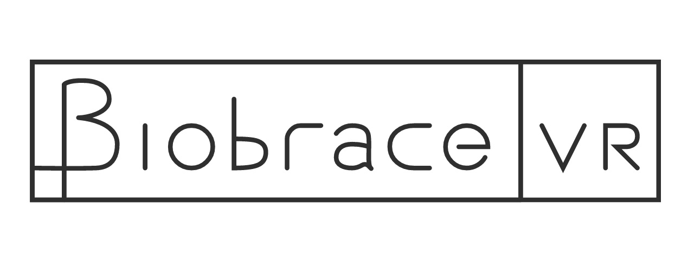
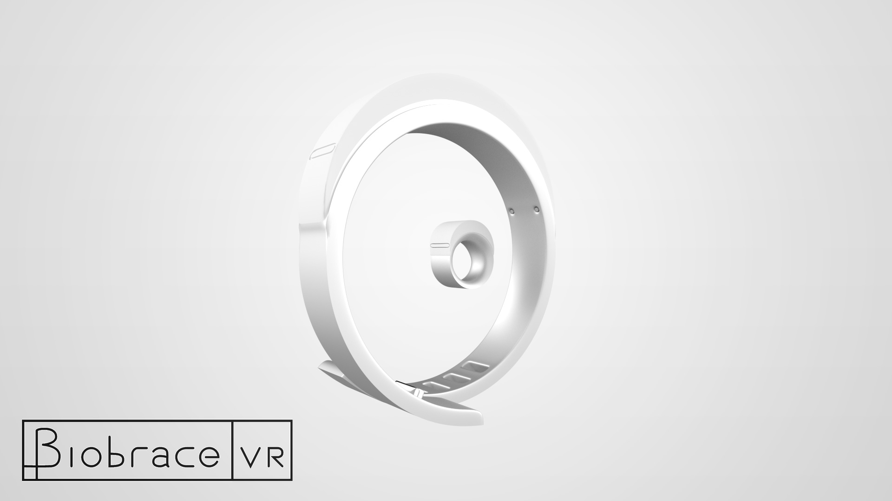

[![License][license-img]][license-url] ![Unreal Version][release-img]

Biobrace VR is a bracelet designed to be used as a gaming input device. It features:

- Galvanic Skin Response Sensors,
- Gyroscope
- Accelerometer
- Magnetometer, 
- Myoware Sensor

This repository features the firmware, concept designs, iOS app, as well as an Unreal Engine 4 demo application.

[license-img]: http://img.shields.io/:license-mit-blue.svg?style=flat-square
[license-url]: https://opensource.org/licenses/MIT
[release-img]: https://img.shields.io/badge/unreal-4.17.0-2a2a2a.svg?style=flat-square